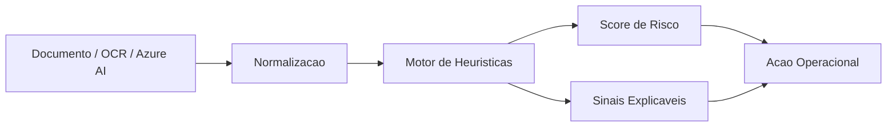

# Analise de Documentos Anti-fraude com Azure AI

A solucao combina uma API em FastAPI, normalizacao de resultados do Azure AI Document Intelligence e um motor de heuristicas para gerar score de risco, sinais explicaveis e recomendacao operacional.

## O que o projeto entrega

- API REST para analise de documentos
- entrada direta com texto extraido e campos estruturados
- endpoint dedicado para normalizar saida do Azure AI Document Intelligence
- score de risco com sinais explicaveis
- exemplos de payloads limpo, suspeito e vindo do Azure
- testes automatizados
- Dockerfile para execucao local

## Arquitetura do MVP



## Endpoints

### `GET /health`

Retorna o status do servico.

### `POST /api/documents/analyze`

Recebe um payload ja estruturado com texto, campos e metadados.

### `POST /api/documents/analyze-azure-result`

Recebe um resultado bruto do Azure AI Document Intelligence e converte para o formato interno antes da analise.

## Exemplo de uso

```json
{
  "document_type": "invoice",
  "extracted_text": "FATURA SAMPLE photoshop rascunho para teste interno",
  "fields": {
    "issuer_name": "Empresa Ficticia",
    "invoice_number": "NF-2025-009",
    "issue_date": "2030-01-15",
    "total_amount": "1000,00",
    "subtotal": "800,00",
    "fees": "50,00",
    "discount": "0,00",
    "cnpj": "11.111.111/1111-11"
  },
  "ocr_confidence": 0.69,
  "metadata": {
    "edited_after_scan": true,
    "previous_submissions": 3,
    "page_count": 1
  }
}
```

## Como executar localmente

### Com Python

```bash
pip install -r requirements.txt
uvicorn app.main:app --reload
```

### Com Docker

```bash
docker build -t azureai-antifraude .
docker run -p 8000:8000 azureai-antifraude
```

## Estrutura do projeto

- `app/main.py`: endpoints da API
- `app/azure_normalizer.py`: normaliza resultados do Azure AI Document Intelligence
- `app/analyzer.py`: regras de risco e score
- `app/validators.py`: validadores de CPF e CNPJ
- `tests/test_analyzer.py`: testes do fluxo principal
- `docs/heuristics.md`: explicacao das heuristicas
- `examples`: payloads prontos para teste

## Heuristicas aplicadas

- campos obrigatorios ausentes por tipo de documento
- baixa confianca de OCR
- reutilizacao excessiva do mesmo arquivo
- metadado de edicao apos o scan
- palavras suspeitas no texto
- CPF ou CNPJ invalidos
- datas futuras ou expiradas
- inconsistencias de total financeiro

## Azure AI no fluxo

O projeto foi estruturado para receber a saida do Azure AI Document Intelligence e transformar esse resultado em uma triagem antifraude explicavel. Em termos praticos:

- o Azure extrai texto e campos
- a API normaliza o payload
- o motor local de regras calcula o risco
- o time ganha uma decisao mais auditavel

Isso evita depender apenas de um modelo opaco e facilita revisao humana, tuning de regras e demonstracao de valor de negocio.

## Referencias oficiais

Usei como base as documentacoes oficiais da Microsoft para alinhar o posicionamento do projeto e o nome atual do servico:

- [Azure AI Document Intelligence code samples](https://learn.microsoft.com/en-us/samples/azure-samples/document-intelligence-code-samples/document-intelligence-code-samples/)
- [Azure AI Document Intelligence samples repository](https://github.com/Azure-Samples/document-intelligence-code-samples)

Observacao: a propria Microsoft destaca que o antigo Form Recognizer foi renomeado para Azure AI Document Intelligence em julho de 2023.

## Validacao

```bash
pytest
```

Os testes cobrem:

- documento limpo com risco baixo
- fatura suspeita com risco alto ou critico
- normalizacao de payload do Azure AI Document Intelligence

## Proximos passos

- adicionar persistencia de casos analisados
- incluir versionamento de regras
- integrar filas e processamento assincrono
- conectar com Azure Blob Storage
- adicionar observabilidade e trilha de auditoria
